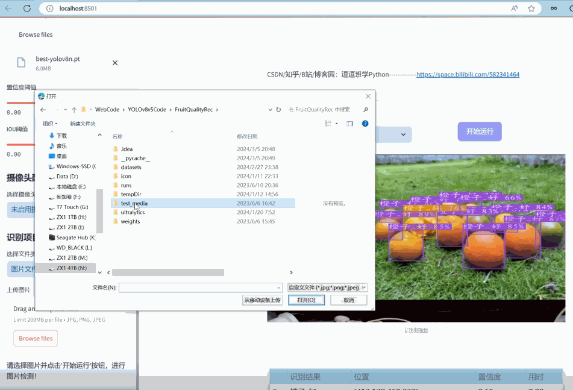
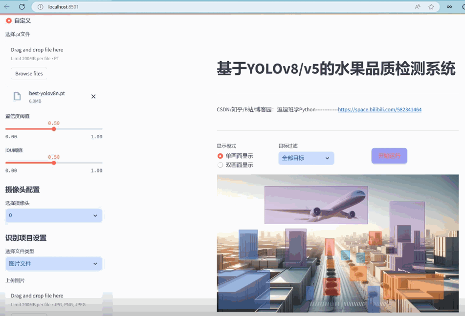
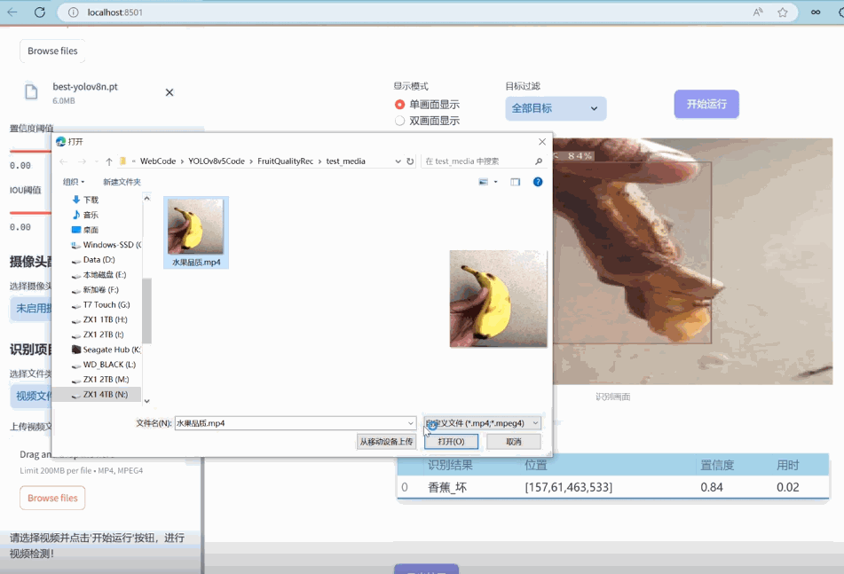
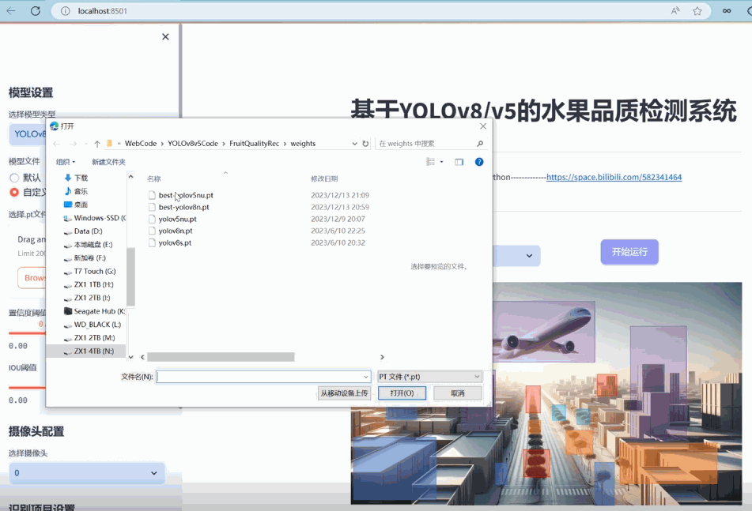
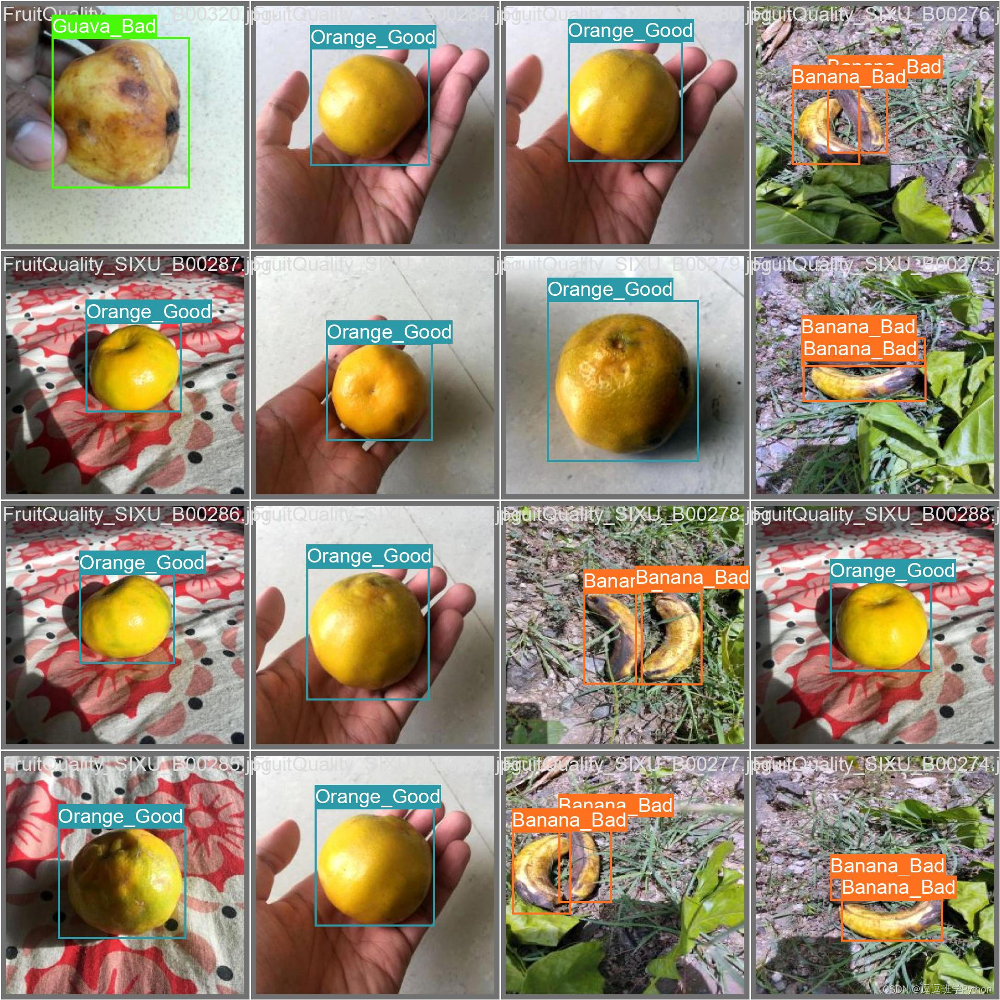
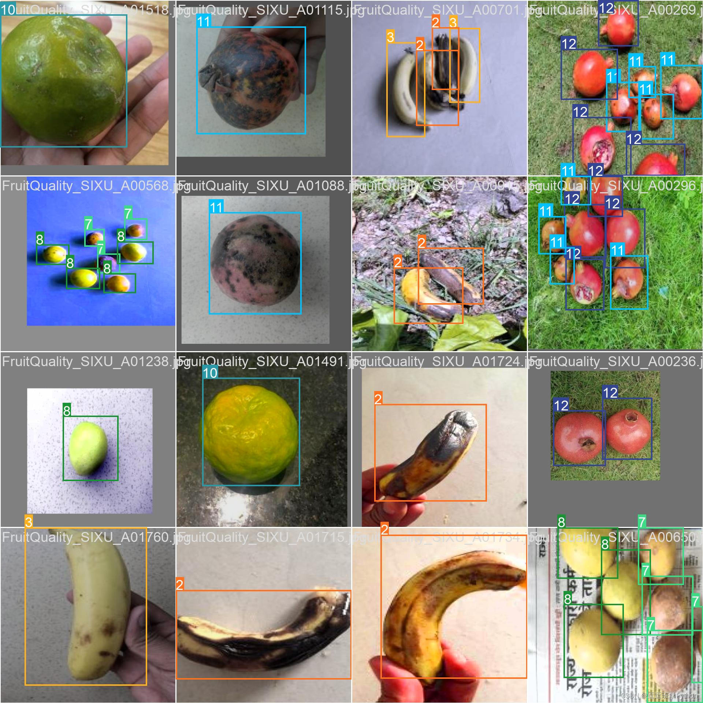
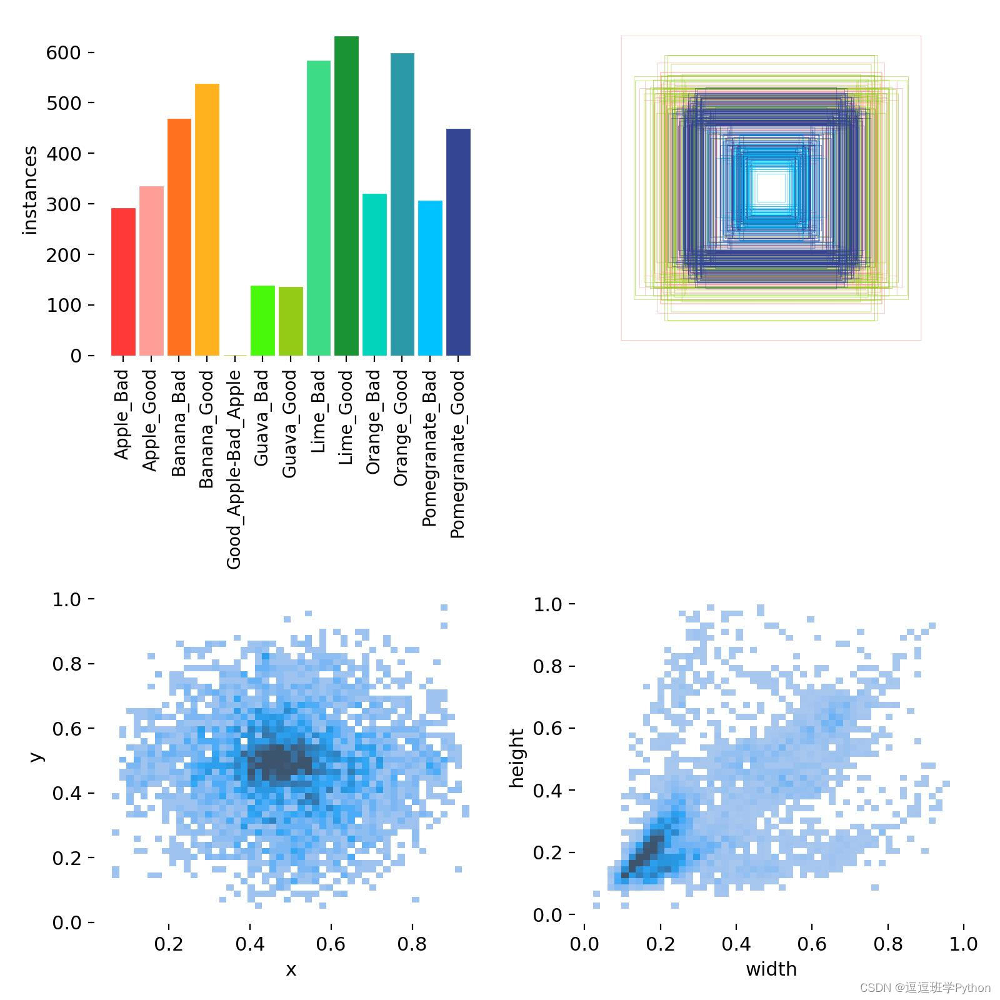
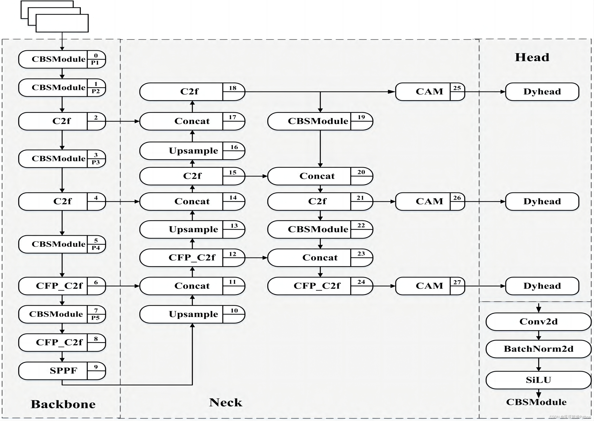
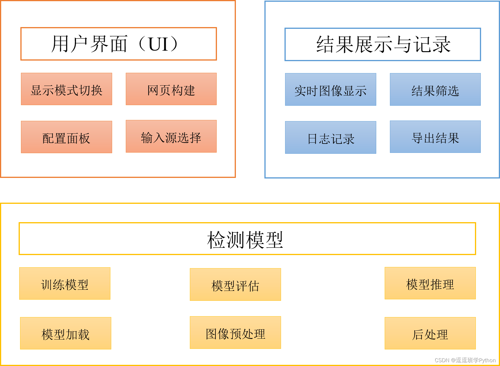
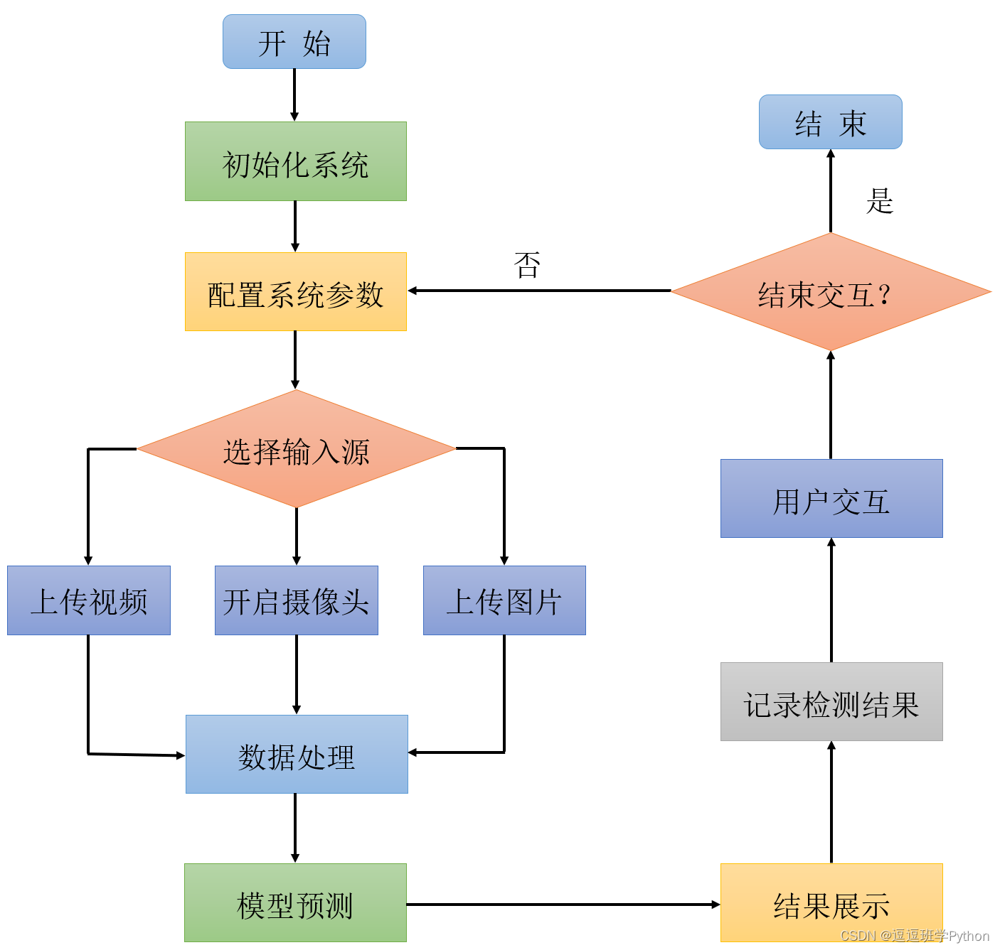

# 基于深度学习的水果品质检测系统（网页版+YOLOv8/v7/v6/v5代码+训练数据集）
- 基于YOLOv8/v7/v6/v5的水果品质检测。
- 核心采用YOLOv8并整合了YOLOv7、YOLOv6、YOLOv5算法。
- 数据集处理、算法原理、模型构建与训练代码。
-  基于Streamlit的交互式Web应用界面设计。
- web网页中可以支持图像、视频和实时摄像头进行水果品质检测，可上传不同训练模型（YOLOv8/v7/v6/v5）进行推理预测，界面可方便修改。

## 程序运行效果
### 1. 网页功能与效果
 （1）开启摄像头实时检测：本系统允许用户通过网页直接开启摄像头，实现对实时视频流中水果品质的检测。系统将自动识别并分析画面中的水果品质，并将检测结果实时显示在用户界面上，为用户提供即时的反馈。

 （2）选择图片检测：用户可以上传本地的图片文件到系统中进行水果品质检测。系统会分析上传的图片，识别出图片中的水果品质，并在界面上展示带有水果品质标签和置信度的检测结果，让用户能够清晰地了解到每个水果品质状态。

 （3）选择视频文件检测：系统支持用户上传视频文件进行水果品质检测。上传的视频将被系统逐帧分析，以识别和标记视频中每一帧的水果品质。用户可以观看带有水果品质检测标记的视频，了解视频中水果品质的变化。

 （4）选择不同训练好的模型文件：系统集成了多个版本的YOLO模型（如YOLOv8/v7/v6/v5），用户可以根据自己的需求选择不同的模型进行水果品质检测。这一功能使得用户能够灵活地比较不同模型的表现，以选择最适合当前任务的模型。

### 2.数据集处理
  我们将深入探讨构建基于YOLO系列模型的水果品质检测数据集的细节。这一数据集旨在为深度学习算法提供丰富的训练、验证和测试样本，以识别和分类不同品质的水果。本数据集包含2583张精心挑选和标注的图像，其中包括1811张训练图像，514张验证图像以及258张测试图像，确保了模型训练和评估的全面性。博主使用的类别如下：
Chinese_name = { 'Apple_Bad': '苹果_坏','Apple_Good': '苹果_好','Banana_Bad': '香蕉_坏','Banana_Good': '香蕉_好',
'Good_Apple-Bad_Apple': '好苹果-坏苹果', 'Guava_Bad': '番石榴_坏', 'Guava_Good': '番石榴_好','Lime_Bad': '酸橙_坏',
'Lime_Good': '酸橙_好', 'Orange_Bad': '橙子_坏','Orange_Good': '橙子_好','Pomegranate_Bad': '石榴_坏', 
'Pomegranate_Good': '石榴_好'}
  为了提高模型的准确性和鲁棒性，我们对图像进行了预处理和增强。所有图像都经过自动方向校正，确保了视觉数据的一致性，并针对模型输入要求调整至统一的640x640分辨率。这样的处理不仅优化了模型训练的效率，也确保了不同来源和尺寸的图像都能被模型正确处理。

  在类别分布上，本数据集覆盖了苹果、香蕉、石榴等多种水果，并分别对它们的好坏品质进行了标注。通过对数据集类别分布的分析，我们发现水果品质的样本量大致均衡，但仍需注意某些类别间的样本量差异。这种不平衡可能会影响模型的泛化能力，因此在模型训练过程中，我们可能需要采取适当的样本平衡技术。
   对于标注框分布，大部分水果目标集中在图像的中央区域。这一现象可能反映了数据采集时的一种倾向，也可能是由于水果在自然排列或展示时的物理特性。无论原因如何，这一特点为我们的目标检测模型提供了额外的先验知识，有助于提升目标定位的速度和精度。
   
### 3.原理与代码介绍--YOLOv8算法
 YOLOv8在输入处理方面采用了Mosaic数据增强技术，这是一种混合式的数据增强手段。它的工作原理是将四张训练图像以一定的比例随机组合到一起，形成一个新的、更丰富的训练样本。这种方法不仅增加了场景的复杂性，模拟了更多的现实情况，而且有效地扩展了训练数据集的大小，有助于模型学习到更多样化的特征，从而提高其泛化能力。更重要的是，Mosaic数据增强能够使得模型在训练过程中同时观察到多个目标，这对于处理实际应用中常见的多目标场景至关重要。
  YOLOv8的Backbone是其算法核心，由CSP（Cross Stage Partial networks）、C2F（Cross Feature Pyramid Networks）和SPPF（Spatial Pyramid Pooling Faster）构成。CSP主要用于实现轻量级的特征提取，通过部分连接的策略，能够减少计算量同时保持网络深度和宽度，使得特征提取过程更加高效。C2F是一种特征金字塔网络，它在不同的网络层次上进行特征的融合，通过这种方式，模型能够同时利用浅层和深层特征，增强对不同尺寸目标的检测能力。而SPPF是对传统空间金字塔池化（SPP）的改进，它在提取多尺度空间特征的同时加速了计算过程，这一点对于实时检测系统至关重要。
   
### 4.系统架构概览
 (1)系统架构:基于YOLOv8/v7/v6/v5实现的水果品质检测系统的架构设计。系统的设计旨在将先进的目标检测算法与用户友好的界面相结合，提供一个高效、准确、易于使用的水果品质检测服务。
 
 (2)系统流程：开发的基于YOLOv8/v7/v6/v5的水果品质检测系统中，流程的设计旨在确保从用户输入到结果输出的每一步都是清晰、高效且用户友好的。下面我们将以类似于程序流程图的形式，详细介绍系统的各个步骤。
 

